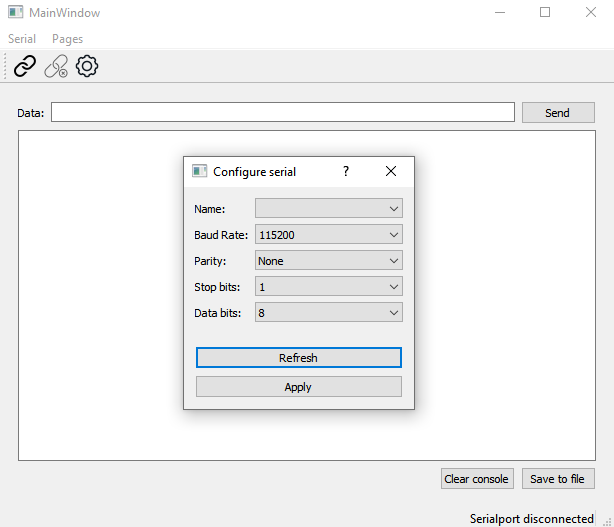
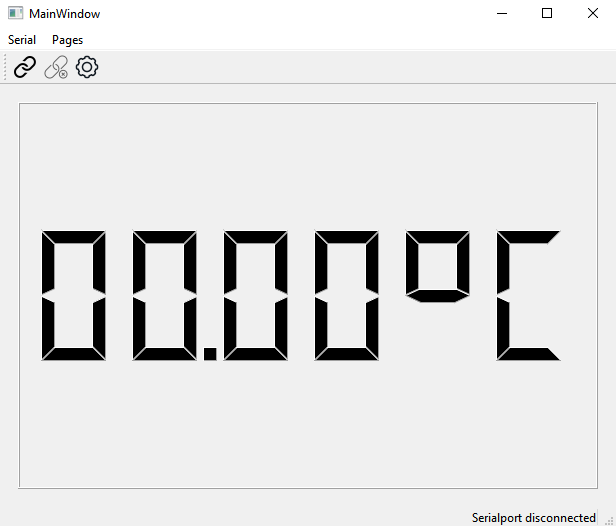

# WorkshopQt
Este repositório contém o código da aplicação apresentada no workshop de Qt realizado em 5/12/2020 no Instituto Politécnico do Cávado e Ave.

Esta aplicação tem como principal funcionalidade abrir uma conexão por porta série com um microcontrolador, receber dados de um sensor de temperatura e apresentá-los num display de 7 segmentos.

A gravação do workshop pode ser acedida neste link: https://alunosipca-my.sharepoint.com/:v:/g/personal/a14848_alunos_ipca_pt/EUVUuJqSBohKvNJct-KYaDkBmN_0IR36rj7UmGgStSRitg?e=DbpUYu

